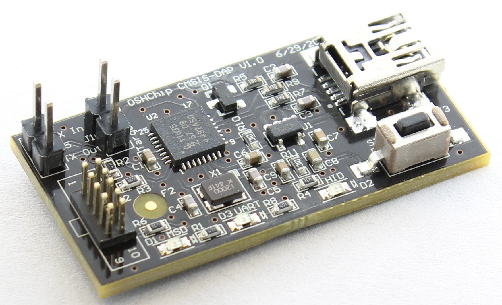

# OSHChip_CMSIS_DAP_V1.0 Design Files

These are the design files for **OSHChip_CMSIS_DAP** version 1.0

This design is derived from mbed CMSIS DAP design.

The original hardware design is here: https://developer.mbed.org/teams/mbed/wiki/SWDAP
The original design files are Eagle format.
OSHChip_CMSIS_DAP_V1.0 is almost identical, but has no jumper wires,
uses USB mini-B rather than USB micro-B connector (probably a mistake.
I'll change it on the next version to micro-B) and most importantly,
OSHChip_CMSIS_DAP_V1.0 makes the USB-to-Serial interface available.
As shown below, OSHChip_CMSIS_DAP_V1.0 is designed with Altium.

The original interface firmware is here https://github.com/mbedmicro/CMSIS-DAP
But the OSHChip_CMSIS_DAP_V1.0 uses the newer version here 
https://github.com/xiongyihui/CMSIS-DAP developed Yihui Xiong of Seeed Studio

The PCB design files are in the directory *Design_Files* and were
created with Altium Designer Release 10

Since you may not have access to Altium Designer, I have also
included all the Gerber files and the Excelon drill file in the
directory *Gerbers_and_Drill_Files*.

In the *Other_Files* directory, you will find the following:
* OSHChip_CMSIS-DAP_V1.0___Schematic.PDF
* OSHChip_CMSIS-DAP_V1.0___PCB_Prints.PDF
* OSHChip_CMSIS-DAP_V1.0___Assembly_Drawings.PDF
* OSHChip_CMSIS-DAP_V1.0___Bill_of_Materials.xls
* OSHChip_CMSIS-DAP_V1.0___Bill_of_Materials.PDF

 

OSHChip by <a xmlns:cc="http://creativecommons.org/ns#" href="www.oshchip.com" 
property="cc:attributionName" rel="cc:attributionURL">Philip Freidin</a>
 is licensed under a  <a rel="license" href="http://creativecommons.org/licenses/by-sa/4.0/">
 Creative Commons Attribution-ShareAlike 4.0 International License</a>.

